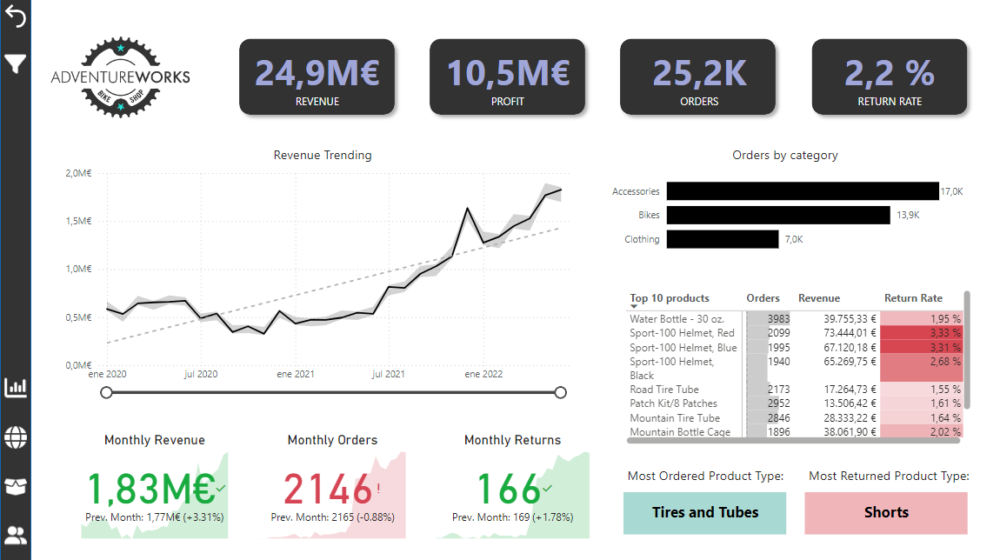
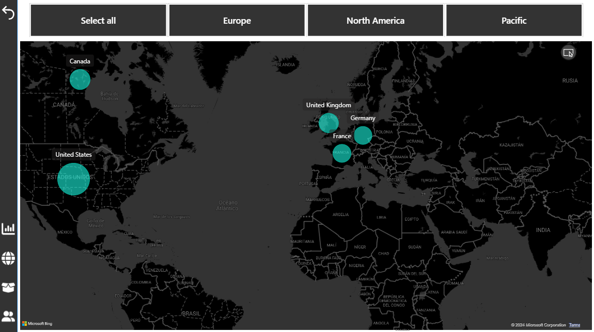
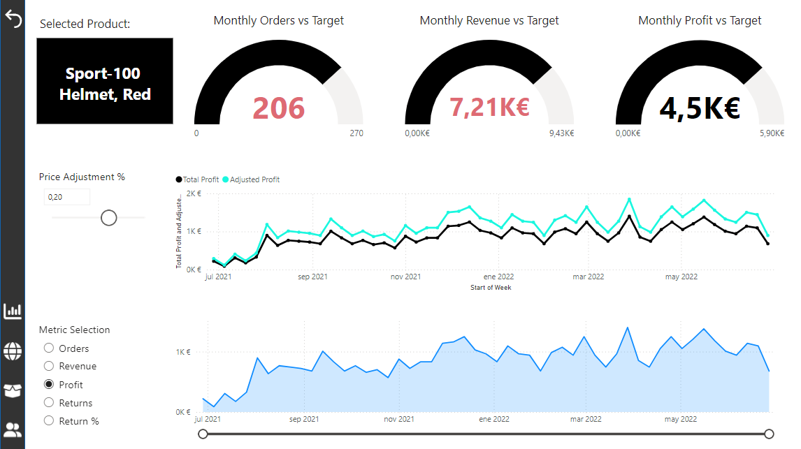
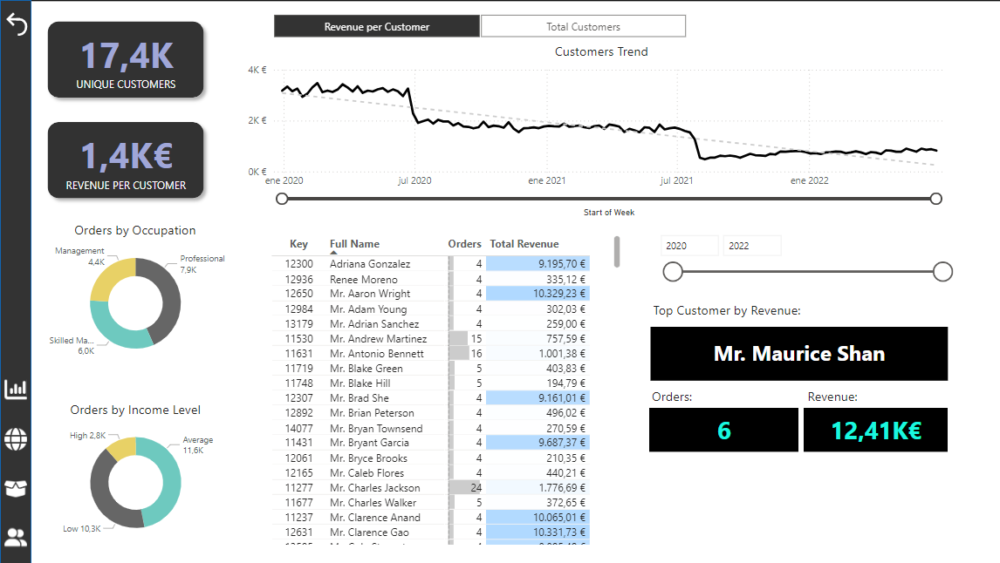

# Power-BI-CycloTech-Business-Intelligence-Report

## Project Overview
The Adventure Works Cycles dataset simulates a manufacturing company's sales data. In this project, I have developed interactive dashboards using Power BI to analyze:
- Sales by region and product category
- Revenue and profit trends
- Customer segmentation and high-value customers
- Return rates and reasons

## Key Features
- **Data Transformation**: Using Power Query to clean and transform raw data into a structured relational model.
- **DAX Calculations**: Developed measures using DAX for revenue, profit, year-over-year comparisons, and dynamic filtering.
- **Visualizations**: Created various visuals, including bar charts, line charts, and maps for geographical insights.
  
## File Structure
- `AdventureWorks_Report.pbix`: The main Power BI file with the dashboard and all DAX calculations.
- `datasets/`: Contains the original datasets used for the analysis.
- `report_snapshots/`: Includes screenshots of the dashboards.
- `scripts/`: DAX measures and Power Query scripts used in the report.

## How to Use
1. Download the `CycloTech_business_report.pbix` file.
2. Open it in [Power BI Desktop](https://powerbi.microsoft.com/desktop/).
3. Review the dataset and explore the interactive dashboards.

## Screenshots
Here are some visual examples from the report:

Executive Dashboard:

Sales Map:

Product Detail Dashboard:

Customer Detail Dashboard:

## License
This project is licensed under the MIT License - see the [LICENSE](./LICENSE) file for details.
